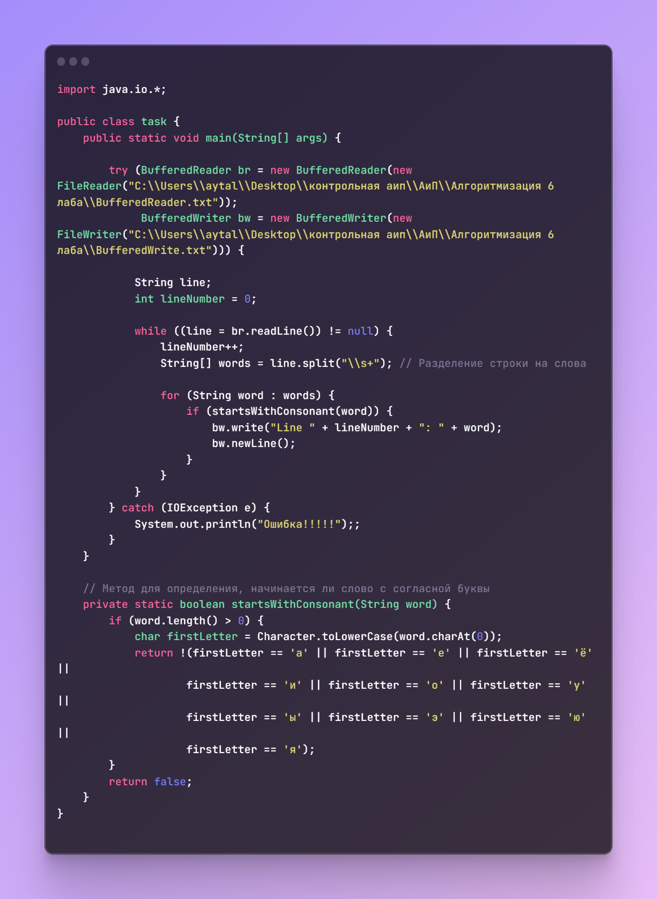

Задание 6.1. В отдельных проектах выполнить примеры 6.1 ÷ 6.5. Протестировать программы с помощью отладчика. Выявить различие в работе программ в примерах 6.2 и 6.3.

Прежде всего, давайте рассмотрим основные различия между примерами 6.2 и 6.3:

1\. Тип потоков:

Пример 6.2 использует символьные потоки (BufferedReader и BufferedWriter), работающие с символами.

Пример 6.3 использует байтовые потоки (FileInputStream, URL.openStream(), ByteArrayInputStream), работающие с байтами.

2\. Работа с кодировкой:

Пример 6.2 использует символьные потоки с указанием кодировки (new FileReader("E:\\\\MyFile1.txt") и new FileWriter("E:\\\\MyFile2.txt")).

Пример 6.3 использует символьные потоки с указанием кодировки (new InputStreamReader(inFile,"cp1251"), new InputStreamReader(inUrl, "cp1251"), new InputStreamReader(inArray,"cp1251" )).

3\. Обработка данных:

Пример 6.2 читает строки целиком из файла, добавляет номер строки и записывает их в другой файл.

Пример 6.3 читает байты из различных источников (файл, URL, массив байт) и выводит их в консоль.

4\. Цель программы:

Пример 6.2 предназначен для копирования строк из одного текстового файла в другой.

Пример 6.3 демонстрирует чтение байтов из разных источников и их вывод в консоль.

5\. Закрытие потоков:

Оба примера правильно закрывают потоки в блоке finally, что важно для правильного освобождения ресурсов.

Таким образом, основное различие между ними заключается в типе потоков и обработке данных. Пример 6.2 ориентирован на работу с текстовыми файлами и строками, в то время как Пример 6.3 демонстрирует работу с байтовыми данными из различных источников.

Пример 6.2 предназначен для копирования строк из одного текстового файла в другой.

Пример 6.3 демонстрирует чтение байтов из разных источников и их вывод в консоль.

5\. Закрытие потоков:

Оба примера правильно закрывают потоки в блоке finally, что важно для правильного освобождения ресурсов.

Таким образом, основное различие между ними заключается в типе потоков и обработке данных. Пример 6.2 ориентирован на работу с текстовыми файлами и строками, в то время как Пример 6.3 демонстрирует работу с байтовыми данными из различных источников.

Задание 6.2. (Вариант 3)

Создать программу, которая из одного текстового файла, содержащего несколько строк (тип String) заранее подготовленного текста на русском языке, построчно переписывает в другой текстовый файл слова, отвечающие некоторому условию.

Требования:

– слова из предложения выделять методом split();

– в новом файле следует указать номер строки, в которой искомые слова находились в исходном файле;

– для каждой строки указать количество выбранных слов.

Программа читает строки из исходного файла. Для каждой строки выполняется следующий алгоритм:

1\. Разделение строки на слова методом split().

2\. Проверка каждого слова на соответствие условию (в данном случае, начинается ли слово с согласной буквы).

3\. Если слово соответствует условию, оно записывается в новый файл вместе с номером строки и количеством выбранных слов для этой строки.

Программа обрабатывает все строки из исходного файла, сохраняя результат в новом файле.

Контрольные вопросы:

1\. Основные классы символьных потоков:

Основные классы символьных потоков включают в себя Reader и Writer. Некоторые из ключевых классов:

FileReader - читает символы из файла.

FileWriter - записывает символы в файл.

StringReader - читает символы из строки.

StringWriter - записывает символы в строку.

BufferedReader - буферизированное чтение символов из потока.

BufferedWriter - буферизированная запись символов в поток.

2\. Реализация чтения/записи данных файла с использованием классов Reader и Writer и присущие недостатки:

Чтение данных:

BufferedReader br = new BufferedReader(new FileReader("file.txt")) - создание буферизированного символьного потока чтения из файла.

Недостаток: Чтение происходит посимвольно, что может быть неэффективным при работе с большими файлами.

Запись данных:

BufferedWriter bw = new BufferedWriter(new FileWriter("file.txt")) - создание буферизированного символьного потока записи в файл.

Недостаток: Запись также происходит посимвольно, что может вызывать накладные расходы при работе с большим объемом данных.

3\. Использование классов буферизированного ввода/вывода, передаваемые параметры, возможность управления кодировкой:

BufferedReader и BufferedWriter предоставляют буферизированный ввод и вывод, что улучшает производительность.

Передаваемые параметры: Параметры включают в себя поток данных, который нужно буферизировать.

Управление кодировкой: Для управления кодировкой символьных потоков, можно использовать классы, наследующие Reader и Writer, например, InputStreamReader и OutputStreamWriter, где можно указать конкретную кодировку.

4\. Конвертирование байтовых потоков в символьные:

Для конвертации байтовых потоков в символьные потоки, используются классы InputStreamReader и OutputStreamWriter.

Пример: Reader reader = new InputStreamReader(inputStream, StandardCharsets.UTF_8);

5\. Использование класса PrintWriter:

PrintWriter облегчает запись форматированного текста в файл.

Пример: PrintWriter writer = new PrintWriter("output.txt");

PrintWriter также автоматически обеспечивает автоматическое переведение строк и предоставляет удобные методы для записи различных типов данных.
